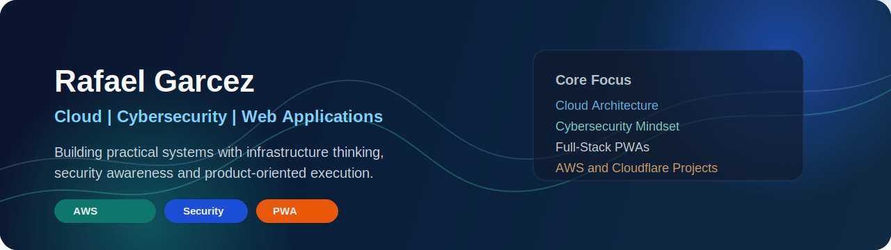

  

<h1 align="center">Rafael Garcez</h1>

<h2 align="center"><strong>Cloud & Cybersecurity | AWS Certified Cloud Practitioner | Blue Team, SOC and Secure Infrastructure</strong></h2>

  
  
  
  

---

## 👨‍💻 Sobre mim

Profissional de TI com mais de 15 anos de experiência em infraestrutura, Linux e operações de redes, com vivência em ambientes NOC e SOC. Essa base prática me deu uma visão sólida sobre operação, disponibilidade, riscos e resposta a incidentes, que hoje direciono para minha transição e consolidação em Cybersecurity e Cloud.

Atualmente aprofundo minhas habilidades por meio de trilhas práticas, certificações e projetos autorais, buscando unir experiência operacional com competências modernas para atuar na proteção de ambientes digitais e na construção de infraestruturas seguras.

---

## 🎯 Foco profissional

- Cybersecurity
- Cloud Security com AWS
- Blue Team, SOC, SIEM e EDR
- Redes e infraestrutura segura
- Automação e operação cloud

---

## 🚀 Em desenvolvimento agora

- AWS e fundamentos de arquitetura em nuvem
- Cloud Security e práticas de hardening
- SIEM, EDR e mentalidade Blue Team
- Automação, observabilidade e operação enxuta

---

## 🧰 Stack principal

  

  
  
  
  

  
  
  
  

- Sistemas operacionais: Linux, Windows Server e administração de ambientes corporativos
- Redes e segurança: Active Directory, GPOs, VPN, certificados digitais, pfSense, segmentação e hardening
- Observabilidade e operação: Zabbix, GLPI, monitoramento, auditoria e suporte a ambientes NOC/SOC
- Backup e continuidade: BorgBackup, tunelamento SSH, estratégia 3-2-1, deduplicação e restauração
- Automação e ferramentas: Python, Shell Script, CLI Linux, Git e SQL básico
- Cloud e plataforma: AWS, Google Cloud, Oracle Cloud, Cloudflare e fundamentos de segurança em nuvem

---

## 🏆 Certificações principais

  
  
  
  

- AWS Certified Cloud Practitioner
- Cisco CyberOps Associate
- Fortinet Certified Associate Cybersecurity
- Oracle Cloud Infrastructure 2025 Certified Foundations Associate
- ISO/IEC 27001:2022 Lead Auditor
- Google Cybersecurity Professional Certificate
- IBM SkillsBuild Cybersecurity Certificate

### Outras certificações e trilhas

- AWS re/Start Graduate
- Google Cloud Cybersecurity Certificate
- Fortinet Certified Fundamentals Cybersecurity
- ISC2 Candidate
- ISO/IEC 42001:2023 Lead Auditor
- SailPoint Identity Security Leader Credential
- OPSWAT Introduction to Critical Infrastructure Protection
- Cisco Junior Cybersecurity Analyst Career Path
- Cisco Network Technician Career Path
- Linux Foundation: OWASP Top 10, XSS Exploits and Defenses, Zero Trust
- MITRE ATT&CK v13 foundations
- API Security studies at APIsec University
- Databricks fundamentals, New Relic foundation and MongoDB core concepts
- Cisco: Introduction to Cybersecurity, Networking Basics, CCNA Introduction to Networks, Endpoint Security, Network Defense, Ethical Hacker, Industrial Cybersecurity Essentials
- IBM SkillsBuild: Cloud Security, Vulnerability Management, System and Network Security, Security Operations and Incident Response
- Fortinet: Threat Landscape, Getting Started in Cybersecurity and Technical Introduction to Cybersecurity
- Outros: English for IT, IoT, Modern AI, Digital Awareness and Computer Hardware Basics

---

## 💼 Experiência de impacto

- Implantação e administração de servidores Linux, Windows Server, AD/DC e GPOs em ambiente corporativo
- Implementação de acesso remoto seguro com OpenVPN, certificados digitais, pfSense e controle de permissão
- Estruturação de monitoramento com Zabbix, integração com GLPI e resposta a falhas operacionais
- Desenvolvimento de estratégia de backup 3-2-1 com BorgBackup, tunelamento SSH e deduplicação
- Aplicação de mitigação de riscos, auditoria de acessos e segurança perimetral em infraestrutura real

---

## 📂 Projetos em destaque

### Casos técnicos de infraestrutura e segurança

- Interfonia digital com Asterisk, integrando softphones, aplicativos VoIP e rede dedicada
- VPN corporativa com OpenVPN + Zentyal + pfSense + certificados digitais
- Backup seguro com BorgBackup, VPN SSH, redundância e restauração rápida
- Operação e suporte a ambientes com monitoramento, impressão corporativa e infraestrutura crítica

### [TranspSaude](https://github.com/Garcez7R/transpsaude)
PWA para apoio à operação do transporte em saúde, com fluxo de solicitação, análise, distribuição operacional e consulta pública. Estruturado com Cloudflare Pages, Functions e D1.

### [TEKA](https://github.com/Garcez7R/mvp-teka)
Marketplace para conectar leitores e sebos, com catálogo, estoque, papéis de usuário, scanner por ISBN, OCR, PWA e arquitetura pensada para crescimento com foco em UX e compliance.

### [Konnektx](https://github.com/Garcez7R/Konnektx)
PWA para barbearias, salões e profissionais de beleza, com página pública, agenda, fidelização e base preparada para evolução com Cloudflare Worker.

---

## 🤝 Experiência e comunidade

- Facilitador do Google Cloud Arcade 2026, apoiando participantes em laboratórios práticos de Kubernetes, BigQuery, IA/ML e Cloud Security
- Voluntariado em iniciativas de comunidade como a CYBERDIMENSION, com foco em aprendizagem colaborativa e segurança
- Evolução contínua com foco em Cloud, Cybersecurity, Blue Team e ambientes operacionais seguros

---

## 📌 Disponibilidade

- Trabalho remoto prioritário
- Aberto a oportunidades presenciais
- PCD e aberto a oportunidades inclusivas

---

## 📫 Contato

  <a href="https://github.com/Garcez7R">GitHub</a>
  •
  <a href="https://www.linkedin.com/in/rgarcez7/">LinkedIn</a>
  •
  <a href="mailto:rgs.dba7@gmail.com">Email</a>

